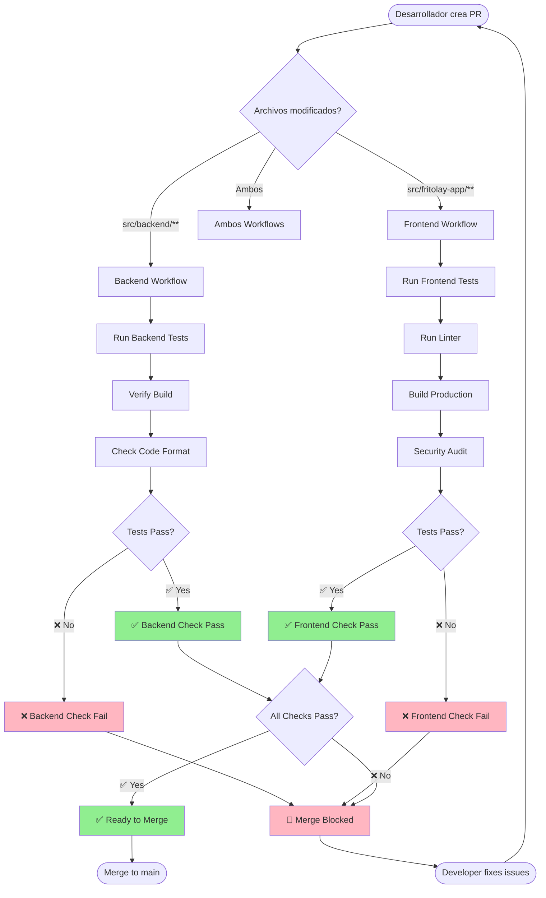
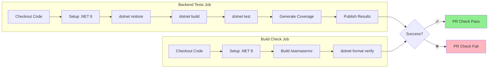
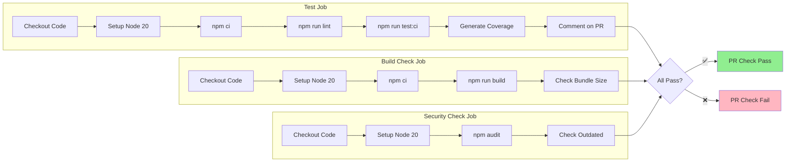
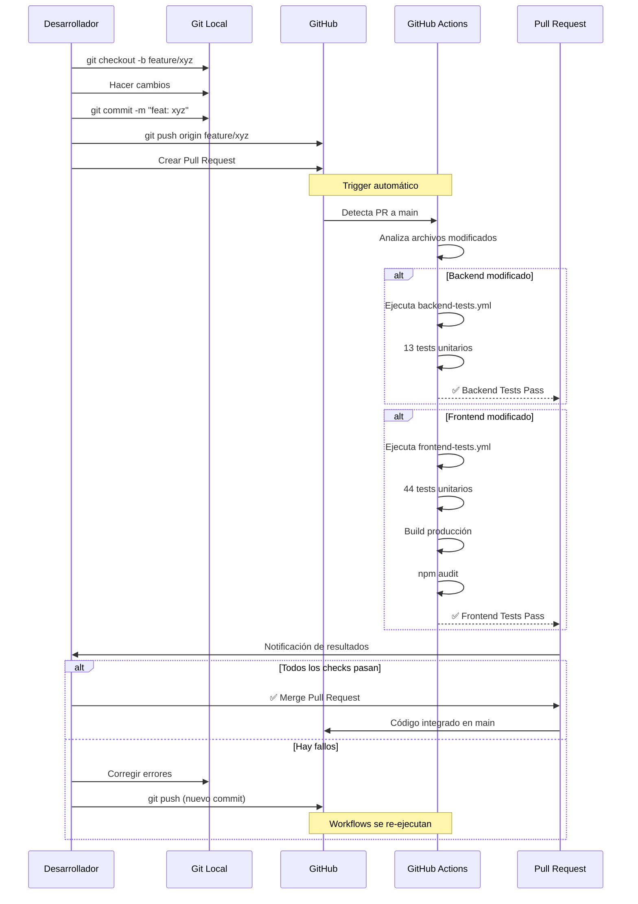
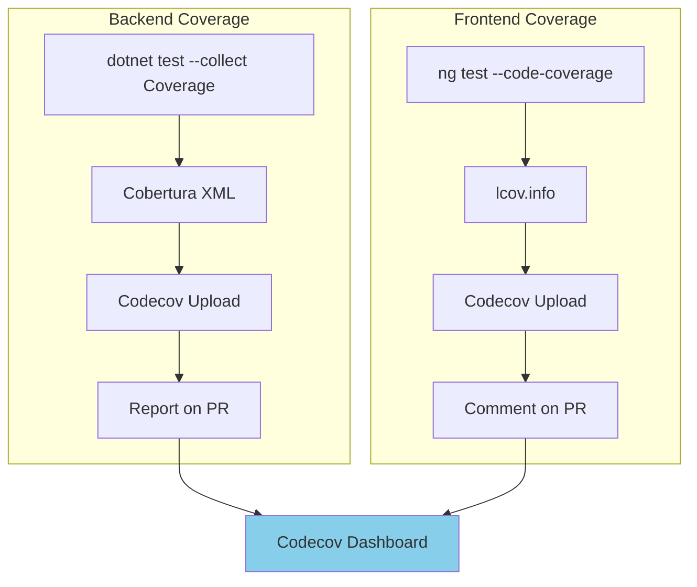
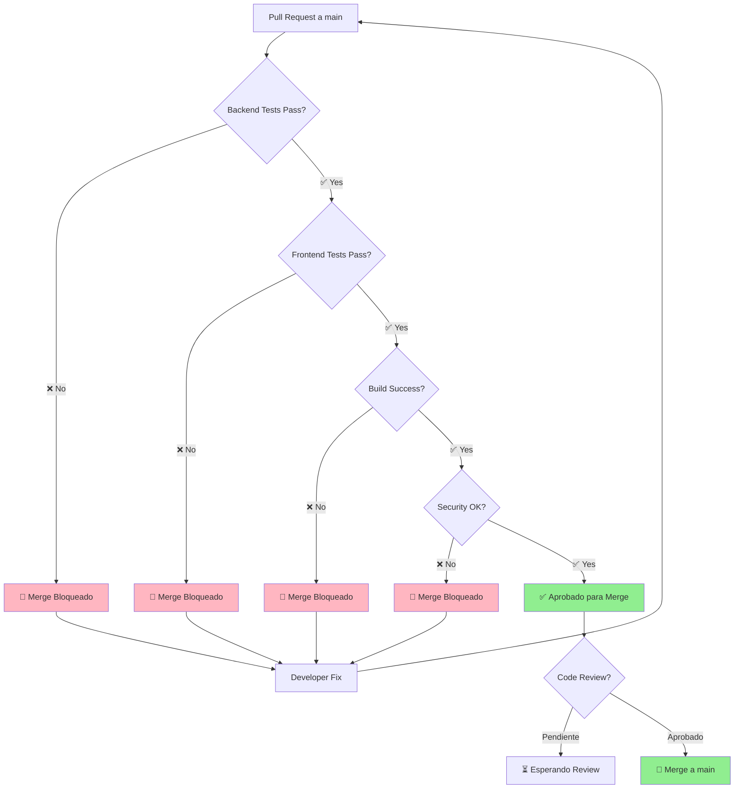
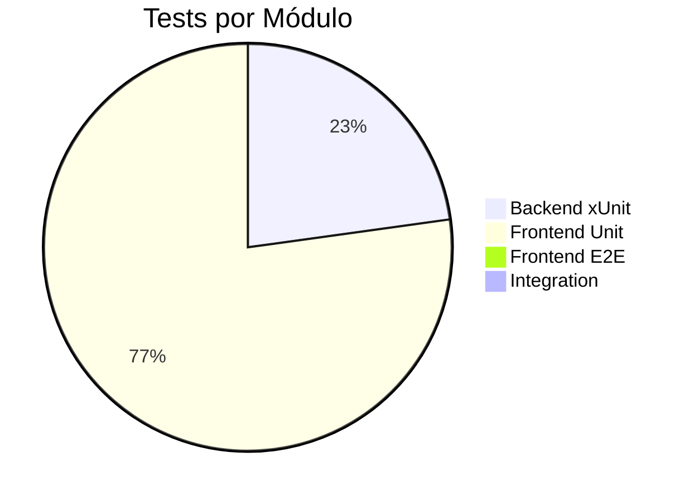

# Diagramas de Flujo - CI/CD Workflows

## 🔄 Flujo General de CI/CD

## 🔧 Backend Workflow Detallado

## 📱 Frontend Workflow Detallado

## 🎯 Flujo de Trabajo del Desarrollador

## 📊 Cobertura de Código

## 🔐 Estrategia de Protección de Rama

## 📈 Métricas de Calidad

**Estado Actual:**

**Cobertura de Código:**

```mermaid
gantt
    title Cobertura de Código
    dateFormat X
    axisFormat %s%%
    
    section Backend
    Statements :done, 0, 100
    Branches   :done, 0, 90
    Functions  :done, 0, 95
    Lines      :done, 0, 98
    
    section Frontend
    Statements :active, 0, 30
    Branches   :active, 0, 13
    Functions  :active, 0, 29
    Lines      :active, 0, 30
```

---

**Última actualización:** 22 de febrero de 2026  
**Versión:** 1.1.0-pre.2-stable
