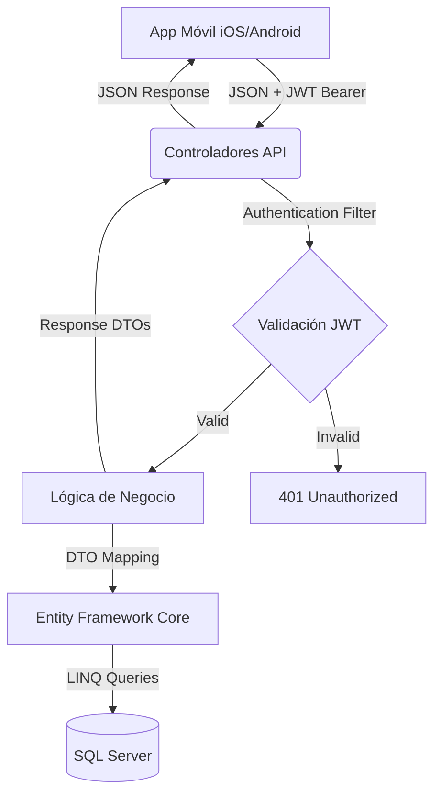

# Documento de Diseño de Software (SDD) - Backend

**Proyecto:** Backend API REST - Gestión de Pedidos Móviles Frito Lay  
**Tecnología:** C# ASP.NET Core 8.0 Web API (Patrón MVC)  
**Base de Datos:** SQL Server con Entity Framework Core  
**Versión:** 1.1.0-pre.1  
**Fecha:** 22 de febrero de 2026  
**Estado:** Pre-Release

---

## 📋 Tabla de Contenidos

1. [Diseño de Arquitectura](#1-diseño-de-arquitectura)
2. [Modelos de Datos](#2-modelos-de-datos)
3. [Controladores y Endpoints](#3-controladores-y-endpoints)
4. [DTOs (Data Transfer Objects)](#4-dtos-data-transfer-objects)
5. [Seguridad y Autenticación](#5-seguridad-y-autenticación)
6. [Lógica de Negocio](#6-lógica-de-negocio)
7. [Migraciones y Base de Datos](#7-migraciones-y-base-de-datos)
8. [Manejo de Errores](#8-manejo-de-errores)

---

## 1. Diseño de Arquitectura

El sistema sigue una arquitectura en capas basada en el patrón **MVC (Modelo-Vista-Controlador)**, actuando como una **API RESTful stateless** con autenticación JWT.

### 1.1 Diagrama de Arquitectura Lógica

El flujo de datos opera de la siguiente manera:

1. **App Móvil:** Realiza peticiones HTTP (JSON) con JWT Bearer token
2. **Capa Controladores (API):** Recibe peticiones, valida JWT y permisos
3. **Capa de Lógica de Negocio:** Ejecuta validaciones, cálculos (impuestos, totales)
4. **Capa de Acceso a Datos (Entity Framework):** Interactúa con SQL Server
5. **Base de Datos:** Almacena entidades con relaciones



### 1.2 Arquitectura en Capas

```
┌─────────────────────────────────────────┐
│         Controllers (API Layer)         │
│  ├─ ControladorCuenta                   │
│  ├─ ControladorProductos                │
│  ├─ ControladorPedidos (v1.1.0)        │
│  └─ InfoController                      │
└─────────────────────────────────────────┘
                    ↓
┌─────────────────────────────────────────┐
│      Business Logic Layer (BLL)         │
│  ├─ Cálculo de Impuestos Dinámicos     │
│  ├─ Validación de Precios               │
│  ├─ Gestión de Estados de Pedidos       │
│  └─ Generación de JWT                   │
└─────────────────────────────────────────┘
                    ↓
┌─────────────────────────────────────────┐
│    Data Access Layer (Entity Framework) │
│  └─ ContextoBaseDatos (DbContext)      │
└─────────────────────────────────────────┘
                    ↓
┌─────────────────────────────────────────┐
│          Database (SQL Server)          │
│  ├─ Cliente                             │
│  ├─ Producto                            │
│  ├─ Pedido (v1.1.0 con GPS)            │
│  └─ DetallePedido                       │
└─────────────────────────────────────────┘
```

### 1.3 Principios de Diseño

- **Stateless:** No se almacena estado de sesión en el servidor
- **Zero Trust:** El backend recalcula todos los precios e impuestos
- **ACID Transactions:** Uso de transacciones para integridad de datos
- **DTO Pattern:** Separación entre modelos de BD y respuestas API
- **JWT Bearer:** Autenticación sin estado con tokens firmados

---

## 2. Modelos de Datos

### 2.1 Entidad: Cliente

```csharp
public class Cliente
{
    [Key]
    public int Id { get; set; }

    [Required]
    [StringLength(100)]
    public string Nombre { get; set; }

    [Required]
    [EmailAddress]
    public string Correo { get; set; }

    [Required]
    [StringLength(20)]
    public string Cedula { get; set; }  // Identificación única

    [Required]
    public string PasswordHash { get; set; }  // BCrypt hash

    [StringLength(15)]
    public string? Telefono { get; set; }

    public DateTime FechaRegistro { get; set; } = DateTime.UtcNow;

    // Relaciones
    public ICollection<Pedido> Pedidos { get; set; } = new List<Pedido>();
}
```

### 2.2 Entidad: Producto

```csharp
public class Producto
{
    [Key]
    public int Id { get; set; }

    [Required]
    [StringLength(200)]
    public string Nombre { get; set; }

    [StringLength(1000)]
    public string? Descripcion { get; set; }

    [Required]
    [Column(TypeName = "decimal(18,2)")]
    public decimal Precio { get; set; }

    [Required]
    [Column(TypeName = "decimal(5,2)")]
    public decimal PorcentajeImpuesto { get; set; }  // 0, 12, 15

    [Required]
    public int Stock { get; set; }

    [StringLength(50)]
    public string? SKU { get; set; }

    [StringLength(100)]
    public string? Linea { get; set; }  // Categoría

    // Imágenes (JSON o relación)
    public string? ImagenUrl1 { get; set; }
    public string? ImagenUrl2 { get; set; }
    public string? ImagenUrl3 { get; set; }

    public bool Activo { get; set; } = true;
}
```

### 2.3 Entidad: Pedido (Actualizado v1.1.0)

```csharp
public class Pedido
{
    [Key]
    public int Id { get; set; }

    [Required]
    public int IdCliente { get; set; }

    [ForeignKey("IdCliente")]
    public Cliente Cliente { get; set; }

    public DateTime FechaPedido { get; set; } = DateTime.UtcNow;

    [Required]
    [StringLength(500)]
    public string DireccionEntrega { get; set; }

    // NUEVO v1.1.0: Geolocalización
    [Column(TypeName = "decimal(10,7)")]
    public decimal? LatitudEntrega { get; set; }

    [Column(TypeName = "decimal(10,7)")]
    public decimal? LongitudEntrega { get; set; }

    [Required]
    [StringLength(50)]
    public string MetodoPago { get; set; }  // Tarjeta, Efectivo, Transferencia

    [StringLength(100)]
    public string? ReferenciaTransferencia { get; set; }

    [Required]
    [StringLength(50)]
    public string Estado { get; set; } = "Pendiente";

    [Column(TypeName = "decimal(18,2)")]
    public decimal Subtotal { get; set; }

    [Column(TypeName = "decimal(18,2)")]
    public decimal Impuesto { get; set; }

    [Column(TypeName = "decimal(18,2)")]
    public decimal Total { get; set; }

    public bool PagoRegistrado { get; set; } = false;

    // Relaciones
    public ICollection<DetallePedido> Detalles { get; set; } = new List<DetallePedido>();
}
```

### 2.4 Entidad: DetallePedido

```csharp
public class DetallePedido
{
    [Key]
    public int Id { get; set; }

    [Required]
    public int IdPedido { get; set; }

    [ForeignKey("IdPedido")]
    public Pedido Pedido { get; set; }

    [Required]
    public int IdProducto { get; set; }

    [ForeignKey("IdProducto")]
    public Producto Producto { get; set; }

    [Required]
    public int Cantidad { get; set; }

    // Histórico de precios (snapshot)
    [Column(TypeName = "decimal(18,2)")]
    public decimal PrecioUnitario { get; set; }

    [Column(TypeName = "decimal(18,2)")]
    public decimal Subtotal { get; set; }

    [Column(TypeName = "decimal(18,2)")]
    public decimal Impuesto { get; set; }

    [Column(TypeName = "decimal(18,2)")]
    public decimal Total { get; set; }
}
```

---

## 3. Controladores y Endpoints

### 3.1 ControladorCuenta (Autenticación)

**Base URL:** `/api/cuenta`

| Método | Endpoint | Descripción | Auth |
|--------|----------|-------------|------|
| POST | `/registrar` | Registra nuevo usuario | No |
| POST | `/login` | Autentica y devuelve JWT | No |
| POST | `/recuperar-password` | Genera código OTP | No |
| POST | `/restablecer-password` | Actualiza contraseña | No |

**Ejemplo Request - Login:**
```json
{
  "cedula": "1234567890",
  "password": "miPassword123"
}
```

**Ejemplo Response - Login:**
```json
{
  "token": "eyJhbGciOiJIUzI1NiIs...",
  "cedula": "1234567890"
}
```

### 3.2 ControladorProductos

**Base URL:** `/api/productos`

| Método | Endpoint | Descripción | Auth |
|--------|----------|-------------|------|
| GET | `/` | Lista todos los productos activos | Opcional |
| GET | `/{id}` | Obtiene producto por ID | Opcional |
| GET | `/linea/{linea}` | Filtra por categoría/línea | Opcional |

**Ejemplo Response - Lista Productos:**
```json
[
  {
    "id": 1,
    "nombre": "Doritos Nacho 150g",
    "descripcion": "Tortillas de maíz sabor queso",
    "precio": 50.00,
    "porcentajeImpuesto": 12.00,
    "stock": 100,
    "sku": "DOR-NAC-150",
    "linea": "Snacks",
    "imagenUrl1": "https://...",
    "activo": true
  }
]
```

### 3.3 ControladorPedidos (Actualizado v1.1.0)

**Base URL:** `/api/ControladorPedidos`

| Método | Endpoint | Descripción | Auth | Versión |
|--------|----------|-------------|------|---------|
| POST | `/crear` | Crea nuevo pedido | JWT | 1.0.0 |
| POST | `/registrar-pago` | Registra pago de pedido | JWT | 1.0.0 |
| **GET** | **/mis-pedidos** | **Lista pedidos del usuario** | **JWT** | **1.1.0** |
| **GET** | **/{id}** | **Detalle de pedido específico** | **JWT** | **1.1.0** |

#### 3.3.1 POST `/crear` - Crear Pedido

**Request Body:**
```json
{
  "direccionEntrega": "Av. Principal 123, Quito",
  "latitudEntrega": -0.1807,
  "longitudEntrega": -78.4678,
  "metodoPago": "Tarjeta",
  "referenciaTransferencia": " ",
  "productos": [
    {
      "idProducto": 1,
      "cantidad": 2
    },
    {
      "idProducto": 5,
      "cantidad": 1
    }
  ]
}
```

**Response:**
```json
{
  "idPedido": 42,
  "mensaje": "Pedido creado exitosamente",
  "total": 168.00
}
```

#### 3.3.2 GET `/mis-pedidos` - Historial de Pedidos (NUEVO v1.1.0)

**Headers:** `Authorization: Bearer {token}`

**Response:**
```json
[
  {
    "id": 42,
    "fechaPedido": "2026-02-22T10:30:00Z",
    "direccionEntrega": "Av. Principal 123",
    "metodoPago": "Tarjeta",
    "estado": "Completado",
    "subtotal": 150.00,
    "impuesto": 18.00,
    "total": 168.00,
    "pagoRegistrado": true
  }
]
```

#### 3.3.3 GET `/{id}` - Detalle de Pedido (NUEVO v1.1.0)

**Headers:** `Authorization: Bearer {token}`

**Response:**
```json
{
  "id": 42,
  "fechaPedido": "2026-02-22T10:30:00Z",
  "direccionEntrega": "Av. Principal 123, Quito",
  "latitudEntrega": -0.1807,
  "longitudEntrega": -78.4678,
  "metodoPago": "Tarjeta",
  "referenciaTransferencia": null,
  "estado": "Completado",
  "subtotal": 150.00,
  "impuesto": 18.00,
  "total": 168.00,
  "pagoRegistrado": true,
  "productos": [
    {
      "idProducto": 1,
      "nombre": "Doritos Nacho 150g",
      "cantidad": 2,
      "precioUnitario": 50.00,
      "subtotal": 100.00,
      "impuesto": 12.00,
      "total": 112.00
    }
  ]
}
```

---

## 4. DTOs (Data Transfer Objects)

### 4.1 DtoCrearPedido (Request)

```csharp
public class DtoCrearPedido
{
    [Required]
    public string DireccionEntrega { get; set; }

    public decimal? LatitudEntrega { get; set; }
    public decimal? LongitudEntrega { get; set; }

    [Required]
    public string MetodoPago { get; set; }

    public string? ReferenciaTransferencia { get; set; }

    [Required]
    public List<DtoProductoPedido> Productos { get; set; }
}

public class DtoProductoPedido
{
    [Required]
    public int IdProducto { get; set; }

    [Required]
    [Range(1, int.MaxValue)]
    public int Cantidad { get; set; }
}
```

### 4.2 DtoLogin (Request)

```csharp
public class DtoLogin
{
    [Required]
    public string Cedula { get; set; }

    [Required]
    public string Password { get; set; }
}
```

### 4.3 DtoRegistro (Request)

```csharp
public class DtoRegistro
{
    [Required]
    public string Nombre { get; set; }

    [Required]
    [EmailAddress]
    public string Correo { get; set; }

    [Required]
    public string Cedula { get; set; }

    [Required]
    [MinLength(6)]
    public string Password { get; set; }

    public string? Telefono { get; set; }
}
```

---

## 5. Seguridad y Autenticación

### 5.1 JWT (JSON Web Tokens)

**Configuración:**
```csharp
services.AddAuthentication(JwtBearerDefaults.AuthenticationScheme)
    .AddJwtBearer(options =>
    {
        options.TokenValidationParameters = new TokenValidationParameters
        {
            ValidateIssuer = true,
            ValidateAudience = true,
            ValidateLifetime = true,
            ValidateIssuerSigningKey = true,
            ValidIssuer = "TuEmisor",
            ValidAudience = "TuAudiencia",
            IssuerSigningKey = new SymmetricSecurityKey(
                Encoding.UTF8.GetBytes("TuClaveSecreta"))
        };
    });
```

**JWT Claims:**
- `sub`: ID del cliente
- `cedula`: Cédula cifrada
- `exp`: Timestamp de expiración

### 5.2 Password Hashing

**Algoritmo:** BCrypt.Net-Next

```csharp
// Registro
string passwordHash = BCrypt.Net.BCrypt.HashPassword(password);

// Login
bool isValid = BCrypt.Net.BCrypt.Verify(passwordIngresado, passwordHash);
```

### 5.3 Protección de Precios (Zero Trust)

**Principio:** El cliente NUNCA envía precios, solo IDs de productos y cantidades.

```csharp
// El backend recalcula TODO
foreach (var item in dtoCrearPedido.Productos)
{
    var producto = await _context.Productos.FindAsync(item.IdProducto);
    
    decimal precioUnitario = producto.Precio;  // ← Precio de BD
    decimal subtotal = precioUnitario * item.Cantidad;
    decimal impuesto = subtotal * (producto.PorcentajeImpuesto / 100);
    decimal total = subtotal + impuesto;
    
    // Guardar en DetallePedido...
}
```

---

## 6. Lógica de Negocio

### 6.1 Cálculo de Impuestos Dinámicos

**Regla:** Cada producto tiene su propio `PorcentajeImpuesto` (0%, 12%, 15%)

```csharp
public decimal CalcularImpuesto(decimal subtotal, decimal porcentaje)
{
    return subtotal * (porcentaje / 100);
}
```

### 6.2 Estados de Pedidos

| Estado | Descripción | Transiciones Permitidas |
|--------|-------------|------------------------|
| `Pendiente` | Pedido creado, esperando pago | → En Proceso, Cancelado |
| `En Proceso` | Pago confirmado, preparando envío | → Enviado |
| `Enviado` | En ruta de entrega | → Completado |
| `Completado` | Entregado exitosamente | (Final) |
| `Cancelado` | Pedido cancelado | (Final) |

### 6.3 Registro de Pagos

**Automático (v1.1.0):**
- Si `metodoPago == "Tarjeta"` → Frontend llama automáticamente al endpoint `/registrar-pago`
- Si `metodoPago == "Efectivo"` o `"Transferencia"` → Queda con `pagoRegistrado = false`

---

## 7. Migraciones y Base de Datos

### 7.1 Contexto de Base de Datos

```csharp
public class ContextoBaseDatos : DbContext
{
    public DbSet<Cliente> Clientes { get; set; }
    public DbSet<Producto> Productos { get; set; }
    public DbSet<Pedido> Pedidos { get; set; }
    public DbSet<DetallePedido> DetallesPedido { get; set; }

    protected override void OnModelCreating(ModelBuilder modelBuilder)
    {
        // Configuración de relaciones
        modelBuilder.Entity<Pedido>()
            .HasOne(p => p.Cliente)
            .WithMany(c => c.Pedidos)
            .HasForeignKey(p => p.IdCliente)
            .OnDelete(DeleteBehavior.Restrict);

        modelBuilder.Entity<DetallePedido>()
            .HasOne(d => d.Pedido)
            .WithMany(p => p.Detalles)
            .HasForeignKey(d => d.IdPedido)
            .OnDelete(DeleteBehavior.Cascade);

        // Índices únicos
        modelBuilder.Entity<Cliente>()
            .HasIndex(c => c.Cedula)
            .IsUnique();

        modelBuilder.Entity<Cliente>()
            .HasIndex(c => c.Correo)
            .IsUnique();
    }
}
```

### 7.2 Migraciones Aplicadas

| Migración | Fecha | Cambios |
|-----------|-------|---------|
| `ConfiguracionInicial` | 2026-01-26 | Creación de tablas Cliente, Producto |
| `AgergarProductosYPedidos` | 2026-02-08 | Tablas Pedido, DetallePedido |
| `Fix-Cuentas-Usuario-Agregar-Cedula` | 2026-02-08 | Campo Cedula en Cliente |
| `Cedula-es-requerida` | 2026-02-08 | Cedula con validación NOT NULL |
| `AddSku` | 2026-02-21 | Campo SKU en Producto |
| `AgregarLinea` | 2026-02-21 | Campo Linea (categoría) en Producto |

---

## 8. Manejo de Errores

### 8.1 Códigos de Estado HTTP

| Código | Descripción | Uso |
|--------|-------------|-----|
| `200 OK` | Éxito | GET exitoso |
| `201 Created` | Recurso creado | POST exitoso (pedido, registro) |
| `400 Bad Request` | Validación fallida | DTO inválido, campos requeridos |
| `401 Unauthorized` | No autenticado | JWT inválido o ausente |
| `403 Forbidden` | No autorizado | Acceso a recurso de otro usuario |
| `404 Not Found` | Recurso no existe | Pedido/Producto no encontrado |
| `500 Server Error` | Error interno | Excepción no controlada |

### 8.2 Formato de Respuesta de Error

```json
{
  "mensaje": "Error de validación",
  "errores": [
    "El campo DireccionEntrega es requerido",
    "La cantidad debe ser mayor a 0"
  ]
}
```

### 8.3 Manejo de Transacciones

```csharp
using var transaction = await _context.Database.BeginTransactionAsync();
try
{
    // Crear pedido
    _context.Pedidos.Add(pedido);
    await _context.SaveChangesAsync();

    // Crear detalles
    foreach (var detalle in detalles)
    {
        _context.DetallesPedido.Add(detalle);
    }
    await _context.SaveChangesAsync();

    await transaction.CommitAsync();
}
catch (Exception)
{
    await transaction.RollbackAsync();
    throw;
}
```

---

## 📚 Referencias

- **ASP.NET Core Documentation:** https://docs.microsoft.com/aspnet/core
- **Entity Framework Core:** https://docs.microsoft.com/ef/core
- **JWT Best Practices:** https://tools.ietf.org/html/rfc7519
- **CHANGELOG.md:** Registro de cambios del proyecto
- **CM_PLAN.md:** Plan de gestión de cambios

---

**Última Actualización:** 22 de febrero de 2026  
**Versión del Documento:** 1.1.0  
**Aprobado por:** Tech Lead
