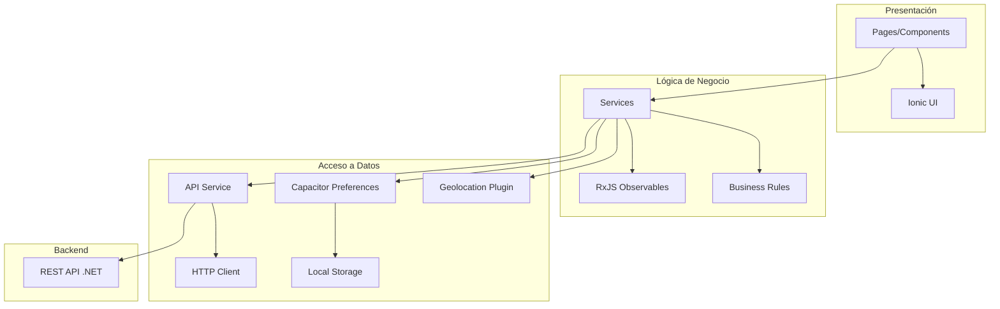

# Documento de Diseño de Software (SDD) - Frontend Móvil

**Proyecto:** Aplicación Móvil de Pedidos Frito Lay  
**Tecnología:** Angular 20 + Ionic 7 + Capacitor 8  
**Plataformas:** iOS, Android, Web  
**Versión:** 1.1.0-pre.1  
**Fecha:** 22 de febrero de 2026  
**Estado:** Pre-Release

---

## 📋 Tabla de Contenidos

1. [Arquitectura General](#1-arquitectura-general)
2. [Estructura del Proyecto](#2-estructura-del-proyecto)
3. [Componentes Principales](#3-componentes-principales)
4. [Servicios](#4-servicios)
5. [Modelos de Datos](#5-modelos-de-datos)
6. [Navegación y Routing](#6-navegación-y-routing)
7. [Gestión de Estado](#7-gestión-de-estado)
8. [Storage y Persistencia](#8-storage-y-persistencia)
9. [Integración con Backend](#9-integración-con-backend)
10. [Seguridad](#10-seguridad)

---

## 1. Arquitectura General

### 1.1 Diagrama de Arquitectura



### 1.2 Patrón de Diseño

La aplicación sigue el patrón **MVVM (Model-View-ViewModel)** adaptado para Angular:

- **View (Template HTML):** Presentación con Ionic components
- **ViewModel (Component .ts):** Lógica de presentación y binding
- **Model (Services + Interfaces):** Datos y lógica de negocio
- **Services:** Capa de abstracción para API y storage

### 1.3 Stack Tecnológico

| Componente | Tecnología | Versión | Propósito |
|------------|------------|---------|-----------|
| **Framework** | Angular | 20.x | Base de la aplicación |
| **UI Framework** | Ionic | 7.x | Componentes móviles |
| **Native Runtime** | Capacitor | 8.x | Acceso a APIs nativas |
| **Lenguaje** | TypeScript | 5.x | Type-safe JavaScript |
| **HTTP Client** | @angular/common/http | 20.x | Comunicación API |
| **Reactive Programming** | RxJS | 7.x | Streams de datos |
| **Storage** | @capacitor/preferences | 8.x | Persistencia local |
| **Geolocalización** | @capacitor/geolocation | 8.x | GPS |
| **Estilos** | SCSS + CSS Variables | - | Theming |

---

## 2. Estructura del Proyecto

### 2.1 Árbol de Directorios

```
src/
├── app/
│   ├── app.component.ts              # Componente raíz
│   ├── app.module.ts                 # Módulo principal
│   ├── app-routing.module.ts         # Configuración de rutas
│   │
│   ├── pages/                        # Páginas de la aplicación
│   │   ├── login/
│   │   │   ├── login.page.ts
│   │   │   ├── login.page.html
│   │   │   ├── login.page.scss
│   │   │   └── login.module.ts
│   │   │
│   │   ├── home/                     # Catálogo de productos
│   │   ├── carrito/                  # Vista del carrito
│   │   ├── checkout/                 # Proceso de compra
│   │   └── mis-pedidos/              # (v1.1.0) Historial
│   │
│   ├── components/                   # Componentes reutilizables
│   │   ├── detalle-pedido-modal/     # (v1.1.0)
│   │   ├── carrito-modal/
│   │   ├── mapa-entrega/
│   │   └── producto-card/
│   │
│   ├── services/                     # Servicios compartidos
│   │   ├── api.service.ts            # Wrapper HTTP
│   │   ├── auth.service.ts           # Autenticación JWT
│   │   ├── pedido.service.ts         # Gestión de pedidos
│   │   ├── carrito.ts                # Gestión del carrito
│   │   └── producto.service.ts       # Catálogo
│   │
│   ├── models/                       # Interfaces TypeScript
│   │   ├── usuario.ts
│   │   ├── producto.ts
│   │   ├── pedido.ts
│   │   └── carrito.ts
│   │
│   └── guards/                       # Protección de rutas
│       └── auth.guard.ts
│
├── assets/                           # Recursos estáticos
│   ├── images/
│   ├── icons/
│   └── fonts/
│
├── environments/                     # Configuración por entorno
│   ├── environment.ts                # Desarrollo
│   └── environment.prod.ts           # Producción
│
├── theme/                            # Estilos globales
│   └── variables.scss                # Variables CSS Ionic
│
├── global.scss                       # Estilos globales
├── index.html                        # HTML raíz
└── main.ts                           # Bootstrap de Angular
```

### 2.2 Convenciones de Nomenclatura

- **Pages:** `nombre.page.ts` - Páginas completas con routing
- **Components:** `nombre.component.ts` - Componentes reutilizables
- **Services:** `nombre.service.ts` - Servicios singleton
- **Models:** `nombre.ts` - Interfaces/tipos TypeScript
- **Guards:** `nombre.guard.ts` - Protectores de rutas

---

## 3. Componentes Principales

### 3.1 LoginPage

**Ubicación:** `src/app/pages/login/`

**Responsabilidad:** Autenticación de usuarios

**Propiedades Clave:**
```typescript
export class LoginPage {
  loginForm: FormGroup;
  
  constructor(
    private authService: AuthService,
    private router: Router,
    private formBuilder: FormBuilder,
    private loadingCtrl: LoadingController,
    private toastCtrl: ToastController
  ) {
    this.loginForm = this.formBuilder.group({
      cedula: ['', [Validators.required, Validators.pattern(/^\d{10}$/)]],
      password: ['', [Validators.required, Validators.minLength(6)]]
    });
  }
  
  async login() {
    if (this.loginForm.valid) {
      const loading = await this.loadingCtrl.create({
        message: 'Autenticando...'
      });
      await loading.present();
      
      this.authService.login(
        this.loginForm.value.cedula,
        this.loginForm.value.password
      ).subscribe({
        next: (response) => {
          loading.dismiss();
          this.router.navigate(['/home']);
        },
        error: (error) => {
          loading.dismiss();
          this.showError(error.message);
        }
      });
    }
  }
}
```

**Template Clave:**
```html
<ion-content>
  <form [formGroup]="loginForm" (ngSubmit)="login()">
    <ion-item>
      <ion-label position="floating">Cédula</ion-label>
      <ion-input formControlName="cedula" type="number"></ion-input>
    </ion-item>
    
    <ion-item>
      <ion-label position="floating">Contraseña</ion-label>
      <ion-input formControlName="password" type="password"></ion-input>
    </ion-item>
    
    <ion-button expand="block" type="submit" [disabled]="!loginForm.valid">
      Iniciar Sesión
    </ion-button>
  </form>
</ion-content>
```

### 3.2 HomePage (Catálogo)

**Ubicación:** `src/app/pages/home/`

**Responsabilidad:** Listar productos disponibles

**Propiedades Clave:**
```typescript
export class HomePage implements OnInit {
  productos: Producto[] = [];
  productosFiltrados: Producto[] = [];
  searchTerm: string = '';
  
  constructor(
    private productoService: ProductoService,
    private carritoService: CarritoService,
    private toastCtrl: ToastController
  ) {}
  
  ngOnInit() {
    this.cargarProductos();
  }
  
  cargarProductos() {
    this.productoService.obtenerProductos().subscribe({
      next: (productos) => {
        this.productos = productos.filter(p => p.activo);
        this.productosFiltrados = this.productos;
      },
      error: (error) => {
        console.error('Error al cargar productos:', error);
      }
    });
  }
  
  buscarProductos(event: any) {
    const searchTerm = event.target.value.toLowerCase();
    
    if (!searchTerm) {
      this.productosFiltrados = this.productos;
      return;
    }
    
    this.productosFiltrados = this.productos.filter(producto =>
      producto.nombre.toLowerCase().includes(searchTerm) ||
      producto.descripcion?.toLowerCase().includes(searchTerm)
    );
  }
  
  agregarAlCarrito(producto: Producto) {
    this.carritoService.agregarProducto(producto);
    this.mostrarToast(`${producto.nombre} agregado al carrito`);
  }
}
```

### 3.3 CheckoutPage (v1.1.0)

**Ubicación:** `src/app/pages/checkout/`

**Responsabilidad:** Proceso de finalización de compra

**Propiedades Clave:**
```typescript
export class CheckoutPage implements OnInit {
  direccionEntrega: string = '';
  metodoPago: string = 'Efectivo';
  referenciaTransferencia: string = '';
  latitud: number | null = null;
  longitud: number | null = null;
  
  productosCarrito: Producto[] = [];
  subtotal: number = 0;
  impuestoTotal: number = 0;
  total: number = 0;
  
  constructor(
    private carritoService: CarritoService,
    private pedidoService: PedidoService,
    private router: Router,
    private loadingCtrl: LoadingController,
    private toastCtrl: ToastController
  ) {}
  
  async ngOnInit() {
    this.cargarCarrito();
    await this.obtenerUbicacion();
  }
  
  async obtenerUbicacion() {
    try {
      const position = await Geolocation.getCurrentPosition();
      this.latitud = position.coords.latitude;
      this.longitud = position.coords.longitude;
    } catch (error) {
      console.error('Error al obtener GPS:', error);
    }
  }
  
  async crearPedido() {
    if (!this.validarFormulario()) return;
    
    const loading = await this.loadingCtrl.create({
      message: 'Creando pedido...'
    });
    await loading.present();
    
    const pedido: DtoCrearPedido = {
      direccionEntrega: this.direccionEntrega,
      latitudEntrega: this.latitud,
      longitudEntrega: this.longitud,
      metodoPago: this.metodoPago,
      referenciaTransferencia: this.metodoPago === 'Transferencia' 
        ? this.referenciaTransferencia 
        : ' ',
      productos: this.productosCarrito.map(p => ({
        idProducto: p.id,
        cantidad: p.cantidad
      }))
    };
    
    this.pedidoService.crearPedido(pedido).subscribe({
      next: async (response) => {
        loading.dismiss();
        
        // Si es pago con tarjeta, registrar automáticamente
        if (this.metodoPago === 'Tarjeta') {
          await this.registrarPagoAutomatico(response.idPedido);
        }
        
        // Limpiar carrito y preferencias
        this.carritoService.vaciarCarrito();
        await this.limpiarTodasLasPreferencias();
        
        this.mostrarExito('Pedido creado exitosamente');
        this.router.navigate(['/mis-pedidos']);
      },
      error: (error) => {
        loading.dismiss();
        this.mostrarError(error);
      }
    });
  }
  
  async limpiarTodasLasPreferencias() {
    await Preferences.remove({ key: 'checkout_delivery_data' });
    await Preferences.remove({ key: 'checkout_pago_data' });
    await Preferences.remove({ key: 'checkout_pedido_data' });
    await Preferences.remove({ key: 'checkout_cache' });
  }
}
```

### 3.4 MisPedidosPage (NUEVO v1.1.0)

**Ubicación:** `src/app/pages/mis-pedidos/`

**Responsabilidad:** Mostrar historial de pedidos

**Propiedades Clave:**
```typescript
export class MisPedidosPage implements OnInit {
  pedidos: Pedido[] = [];
  cargando: boolean = true;
  
  constructor(
    private pedidoService: PedidoService,
    private modalCtrl: ModalController
  ) {}
  
  ngOnInit() {
    this.cargarPedidos();
  }
  
  cargarPedidos() {
    this.pedidoService.obtenerMisPedidos().subscribe({
      next: (pedidos) => {
        this.pedidos = pedidos;
        this.cargando = false;
      },
      error: (error) => {
        console.error('Error al cargar pedidos:', error);
        this.cargando = false;
      }
    });
  }
  
  async abrirDetallePedido(pedido: Pedido) {
    const modal = await this.modalCtrl.create({
      component: DetallePedidoModalComponent,
      componentProps: {
        idPedido: pedido.id
      }
    });
    
    await modal.present();
  }
  
  getEstadoColor(estado: string): string {
    const colores: Record<string, string> = {
      'Pendiente': 'warning',
      'En Proceso': 'primary',
      'Enviado': 'secondary',
      'Completado': 'success',
      'Cancelado': 'danger'
    };
    return colores[estado] || 'medium';
  }
}
```

### 3.5 DetallePedidoModalComponent (NUEVO v1.1.0)

**Ubicación:** `src/app/components/detalle-pedido-modal/`

**Responsabilidad:** Mostrar detalles completos de un pedido

```typescript
export class DetallePedidoModalComponent implements OnInit {
  @Input() idPedido!: number;
  
  pedido: Pedido | null = null;
  cargando: boolean = true;
  
  constructor(
    private pedidoService: PedidoService,
    private modalCtrl: ModalController
  ) {}
  
  ngOnInit() {
    this.cargarDetalles();
  }
  
  cargarDetalles() {
    this.pedidoService.obtenerPedidoPorId(this.idPedido).subscribe({
      next: (pedido) => {
        this.pedido = pedido;
        this.cargando = false;
      },
      error: (error) => {
        console.error('Error al cargar pedido:', error);
        this.cargando = false;
      }
    });
  }
  
  cerrarModal() {
    this.modalCtrl.dismiss();
  }
}
```

---

## 4. Servicios

### 4.1 ApiService (v1.1.0)

**Ubicación:** `src/app/services/api.service.ts`

**Responsabilidad:** Wrapper HTTP con limpieza automática de datos

```typescript
@Injectable({
  providedIn: 'root'
})
export class ApiService {
  private baseUrl: string;
  
  constructor(private http: HttpClient) {
    this.baseUrl = environment.apiUrl;
  }
  
  /**
   * Realiza POST request limpiando valores undefined/null
   */
  post<T>(endpoint: string, body: any): Observable<T> {
    const cleanedBody = this.cleanObject(body);
    const url = `${this.baseUrl}/${endpoint}`;
    
    return this.http.post<T>(url, cleanedBody, {
      headers: this.getHeaders()
    }).pipe(
      catchError(error => {
        const errorMessage = this.extractErrorMessage(error);
        return throwError(() => new Error(errorMessage));
      })
    );
  }
  
  /**
   * Realiza GET request
   */
  get<T>(endpoint: string): Observable<T> {
    const url = `${this.baseUrl}/${endpoint}`;
    
    return this.http.get<T>(url, {
      headers: this.getHeaders()
    }).pipe(
      catchError(error => {
        const errorMessage = this.extractErrorMessage(error);
        return throwError(() => new Error(errorMessage));
      })
    );
  }
  
  /**
   * Limpia propiedades undefined y null recursivamente
   */
  private cleanObject(obj: any): any {
    if (obj === null || obj === undefined) {
      return obj;
    }
    
    if (Array.isArray(obj)) {
      return obj.map(item => this.cleanObject(item));
    }
    
    if (typeof obj === 'object') {
      const cleaned: any = {};
      
      for (const key in obj) {
        if (obj.hasOwnProperty(key)) {
          const value = obj[key];
          
          // Solo incluir si no es undefined o null
          if (value !== undefined && value !== null) {
            cleaned[key] = this.cleanObject(value);
          }
        }
      }
      
      return cleaned;
    }
    
    return obj;
  }
  
  /**
   * Extrae mensaje de error del backend
   */
  private extractErrorMessage(error: any): string {
    if (error.error && error.error.mensaje) {
      return error.error.mensaje;
    }
    
    if (error.error && typeof error.error === 'string') {
      return error.error;
    }
    
    if (error.message) {
      return error.message;
    }
    
    return 'Error desconocido';
  }
  
  private getHeaders(): HttpHeaders {
    let headers = new HttpHeaders({
      'Content-Type': 'application/json'
    });
    
    const token = localStorage.getItem('token_jwt');
    if (token) {
      headers = headers.set('Authorization', `Bearer ${token}`);
    }
    
    return headers;
  }
}
```

### 4.2 AuthService

**Ubicación:** `src/app/services/auth.service.ts`

**Responsabilidad:** Gestión de autenticación JWT

```typescript
@Injectable({
  providedIn: 'root'
})
export class AuthService {
  private isAuthenticatedSubject = new BehaviorSubject<boolean>(false);
  public isAuthenticated$ = this.isAuthenticatedSubject.asObservable();
  
  constructor(
    private apiService: ApiService,
    private router: Router
  ) {
    this.checkAuthStatus();
  }
  
  async checkAuthStatus() {
    const token = await Preferences.get({ key: 'token_jwt' });
    this.isAuthenticatedSubject.next(!!token.value);
  }
  
  login(cedula: string, password: string): Observable<any> {
    return this.apiService.post('cuenta/login', { cedula, password }).pipe(
      tap(async (response: any) => {
        await Preferences.set({
          key: 'token_jwt',
          value: response.token
        });
        
        await Preferences.set({
          key: 'user_cedula',
          value: response.cedula
        });
        
        this.isAuthenticatedSubject.next(true);
      })
    );
  }
  
  async logout() {
    await Preferences.remove({ key: 'token_jwt' });
    await Preferences.remove({ key: 'user_cedula' });
    this.isAuthenticatedSubject.next(false);
    this.router.navigate(['/login']);
  }
  
  async getToken(): Promise<string | null> {
    const token = await Preferences.get({ key: 'token_jwt' });
    return token.value;
  }
  
  isLoggedIn(): boolean {
    return this.isAuthenticatedSubject.value;
  }
}
```

### 4.3 CarritoService (v1.1.0)

**Ubicación:** `src/app/services/carrito.ts`

**Responsabilidad:** Gestión del carrito de compras

```typescript
@Injectable({
  providedIn: 'root'
})
export class CarritoService {
  private carritoSubject = new BehaviorSubject<Producto[]>([]);
  public carrito$ = this.carritoSubject.asObservable();
  
  constructor() {
    this.cargarStorage();
  }
  
  agregarProducto(producto: Producto) {
    const carrito = this.carritoSubject.value;
    const index = carrito.findIndex(p => p.id === producto.id);
    
    if (index >= 0) {
      carrito[index].cantidad += 1;
    } else {
      carrito.push({ ...producto, cantidad: 1 });
    }
    
    this.carritoSubject.next(carrito);
    this.guardarStorage();
  }
  
  eliminarProducto(idProducto: number) {
    const carrito = this.carritoSubject.value.filter(p => p.id !== idProducto);
    this.carritoSubject.next(carrito);
    this.guardarStorage();
  }
  
  /**
   * NUEVO v1.1.0: Vacía completamente el carrito
   */
  async vaciarCarrito() {
    this.carritoSubject.next([]);
    await Preferences.remove({ key: 'carrito_compras' });
  }
  
  private async guardarStorage() {
    await Preferences.set({
      key: 'carrito_compras',
      value: JSON.stringify(this.carritoSubject.value)
    });
  }
  
  private async cargarStorage() {
    const carrito = await Preferences.get({ key: 'carrito_compras' });
    
    if (carrito.value) {
      const productos = JSON.parse(carrito.value);
      this.carritoSubject.next(productos);
    }
  }
  
  calcularSubtotal(): number {
    return this.carritoSubject.value.reduce(
      (total, p) => total + (p.precio * p.cantidad),
      0
    );
  }
  
  calcularImpuestos(): number {
    return this.carritoSubject.value.reduce(
      (total, p) => total + ((p.precio * p.cantidad) * (p.porcentajeImpuesto / 100)),
      0
    );
  }
  
  calcularTotal(): number {
    return this.calcularSubtotal() + this.calcularImpuestos();
  }
}
```

### 4.4 PedidoService (v1.1.0)

**Ubicación:** `src/app/services/pedido.service.ts`

**Responsabilidad:** Operaciones CRUD de pedidos

```typescript
@Injectable({
  providedIn: 'root'
})
export class PedidoService {
  constructor(private apiService: ApiService) {}
  
  crearPedido(pedido: DtoCrearPedido): Observable<any> {
    return this.apiService.post('ControladorPedidos/crear', pedido);
  }
  
  /**
   * NUEVO v1.1.0: Obtiene pedidos del usuario autenticado
   */
  obtenerMisPedidos(): Observable<Pedido[]> {
    return this.apiService.get<Pedido[]>('ControladorPedidos/mis-pedidos');
  }
  
  /**
   * NUEVO v1.1.0: Obtiene detalles de un pedido
   */
  obtenerPedidoPorId(id: number): Observable<Pedido> {
    return this.apiService.get<Pedido>(`ControladorPedidos/${id}`);
  }
  
  registrarPago(idPedido: number, datosPago: any): Observable<any> {
    return this.apiService.post('ControladorPedidos/registrar-pago', {
      idPedido,
      ...datosPago
    });
  }
}
```

---

## 5. Modelos de Datos

### 5.1 Interfaces Principales

```typescript
// src/app/models/producto.ts
export interface Producto {
  id: number;
  nombre: string;
  descripcion?: string;
  precio: number;
  porcentajeImpuesto: number;
  stock: number;
  sku?: string;
  linea?: string;
  imagenUrl1?: string;
  imagenUrl2?: string;
  imagenUrl3?: string;
  activo: boolean;
  cantidad?: number;  // Para carrito
}

// src/app/models/pedido.ts
export interface Pedido {
  id: number;
  fechaPedido: string;
  direccionEntrega: string;
  latitudEntrega?: number;
  longitudEntrega?: number;
  metodoPago: string;
  referenciaTransferencia?: string;
  estado: string;
  subtotal: number;
  impuesto: number;
  total: number;
  pagoRegistrado: boolean;
  productos?: DetallePedido[];
}

export interface DetallePedido {
  idProducto: number;
  nombre: string;
  cantidad: number;
  precioUnitario: number;
  subtotal: number;
  impuesto: number;
  total: number;
}

export interface DtoCrearPedido {
  direccionEntrega: string;
  latitudEntrega?: number | null;
  longitudEntrega?: number | null;
  metodoPago: string;
  referenciaTransferencia?: string;
  productos: DtoProductoPedido[];
}

export interface DtoProductoPedido {
  idProducto: number;
  cantidad: number;
}

// src/app/models/usuario.ts
export interface Usuario {
  id: number;
  nombre: string;
  correo: string;
  cedula: string;
  telefono?: string;
}
```

---

## 6. Navegación y Routing

### 6.1 Configuración de Rutas

```typescript
// src/app/app-routing.module.ts
const routes: Routes = [
  {
    path: '',
    redirectTo: 'login',
    pathMatch: 'full'
  },
  {
    path: 'login',
    loadChildren: () => import('./pages/login/login.module')
      .then(m => m.LoginPageModule)
  },
  {
    path: 'home',
    loadChildren: () => import('./pages/home/home.module')
      .then(m => m.HomePageModule),
    canActivate: [AuthGuard]
  },
  {
    path: 'carrito',
    loadChildren: () => import('./pages/carrito/carrito.module')
      .then(m => m.CarritoPageModule),
    canActivate: [AuthGuard]
  },
  {
    path: 'checkout',
    loadChildren: () => import('./pages/checkout/checkout.module')
      .then(m => m.CheckoutPageModule),
    canActivate: [AuthGuard]
  },
  {
    path: 'mis-pedidos',
    loadChildren: () => import('./pages/mis-pedidos/mis-pedidos.module')
      .then(m => m.MisPedidosPageModule),
    canActivate: [AuthGuard]
  }
];
```

### 6.2 AuthGuard

```typescript
// src/app/guards/auth.guard.ts
@Injectable({
  providedIn: 'root'
})
export class AuthGuard implements CanActivate {
  constructor(
    private authService: AuthService,
    private router: Router
  ) {}
  
  async canActivate(): Promise<boolean> {
    const token = await this.authService.getToken();
    
    if (token) {
      return true;
    }
    
    this.router.navigate(['/login']);
    return false;
  }
}
```

---

## 7. Gestión de Estado

### 7.1 Patrón Observable con RxJS

La aplicación utiliza **BehaviorSubject** para gestión de estado reactivo:

```typescript
// Ejemplo: CarritoService
private carritoSubject = new BehaviorSubject<Producto[]>([]);
public carrito$ = this.carritoSubject.asObservable();

// Componente se suscribe
this.carritoService.carrito$.subscribe(productos => {
  this.productosCarrito = productos;
});
```

### 7.2 Estado Global vs Local

| Tipo | Ubicación | Ejemplo |
|------|-----------|---------|
| **Global** | Services con BehaviorSubject | Carrito, Auth |
| **Local** | Propiedades del componente | Formularios, UI state |
| **Persistente** | Capacitor Preferences | Token JWT, Carrito |

---

## 8. Storage y Persistencia

### 8.1 Capacitor Preferences

**Claves utilizadas:**

| Clave | Tipo | Descripción | Limpieza |
|-------|------|-------------|----------|
| `token_jwt` | string | JWT de autenticación | Al logout |
| `user_cedula` | string | Cédula del usuario | Al logout |
| `carrito_compras` | JSON | Array de productos | Post-orden (v1.1.0) |
| `checkout_delivery_data` | JSON | Datos de entrega | Post-orden (v1.1.0) |
| `checkout_pago_data` | JSON | Método de pago | Post-orden (v1.1.0) |
| `checkout_pedido_data` | JSON | Resumen pre-orden | Post-orden (v1.1.0) |

### 8.2 Estrategia de Limpieza (v1.1.0)

```typescript
async limpiarTodasLasPreferencias() {
  await Preferences.remove({ key: 'checkout_delivery_data' });
  await Preferences.remove({ key: 'checkout_pago_data' });
  await Preferences.remove({ key: 'checkout_pedido_data' });
  await Preferences.remove({ key: 'checkout_cache' });
  await Preferences.remove({ key: 'carrito_compras' });
}
```

---

## 9. Integración con Backend

### 9.1 Endpoints Consumidos

| Endpoint | Método | Servicio | Componente |
|----------|--------|----------|------------|
| `/cuenta/login` | POST | AuthService | LoginPage |
| `/cuenta/registrar` | POST | AuthService | RegisterPage |
| `/productos` | GET | ProductoService | HomePage |
| `/ControladorPedidos/crear` | POST | PedidoService | CheckoutPage |
| `/ControladorPedidos/mis-pedidos` | GET | PedidoService | MisPedidosPage (v1.1.0) |
| `/ControladorPedidos/{id}` | GET | PedidoService | DetallePedidoModal (v1.1.0) |

### 9.2 Manejo de Errores HTTP

```typescript
// ApiService maneja errores centralizadamente
private extractErrorMessage(error: any): string {
  if (error.error?.mensaje) return error.error.mensaje;
  if (error.error && typeof error.error === 'string') return error.error;
  if (error.message) return error.message;
  return 'Error desconocido';
}
```

---

## 10. Seguridad

### 10.1 Autenticación JWT

- Token almacenado en Capacitor Preferences (cifrado nativo)
- Header `Authorization: Bearer {token}` en cada request
- AuthGuard protege rutas privadas
- Auto-logout si token expira (401 Unauthorized)

### 10.2 Validación de Datos

- **Formularios Reactivos** con Validators de Angular
- **cleanObject()** elimina `undefined`/`null` antes de enviar
- Backend valida y recalcula precios (Zero Trust)

### 10.3 Seguridad de GPS

- Captura de coordenadas solo con permiso del usuario
- Almacenamiento en backend para audit trail
- No se expone en logs de producción

---

## 📚 Referencias

- **Angular Documentation:** https://angular.io/docs
- **Ionic Framework:** https://ionicframework.com/docs
- **Capacitor:** https://capacitorjs.com/docs
- **RxJS:** https://rxjs.dev/guide/overview
- **CHANGELOG.md:** Historial de cambios del proyecto

---

**Última Actualización:** 22 de febrero de 2026  
**Versión del Documento:** 1.1.0  
**Aprobado por:** Wilson Salinas
