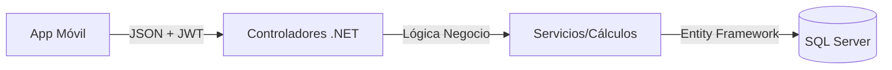

# 🛒 Aplicación de Pedidos Móviles Frito Lay

> Sistema completo de gestión de pedidos para distribuidores de Frito Lay


---

## 📋 Tabla de Contenidos

- [Características](#características-principales)
- [Tecnologías](#tecnologías)
- [Arquitectura](#arquitectura-general)
- **[Frontend Móvil](#-aplicación-móvil-frontend)**
- **[Backend API](#backend-rest-api)**
- [Primeros Pasos](#primeros-pasos)
- [Desarrollo](#desarrollo)
- [Cambios Recientes](#cambios-en-v110-pre1)

---

# 📱 Aplicación Móvil (Frontend)

Aplicación cross-platform construida con **Angular 20** + **Ionic 7** + **Capacitor 8**, optimizada para distribuidores móviles de productos Frito Lay.

### Características del Frontend

* **Catálogo de Productos:** Navegación fluida con filtros, búsqueda y favoritos
* **Carrito Inteligente:** Gestión local con persistencia Capacitor Preferences
* **Checkout Completo:** 
  - Múltiples métodos de pago (Tarjeta, Efectivo, Transferencia)
  - Registro automático de pagos con Tarjeta
  - Validación de datos de entrega (dirección + GPS)
* **Gestión de Pedidos:** Visualización de órdenes pasadas con detalles completos
* **Autenticación Segura:** Login con JWT, cédula validada en backend
* **Localización en Tiempo Real:** Captura de GPS para punto de entrega
* **Interfaz Responsive:** Adaptable a diversos tamaños de pantalla móvil

### Stack Tecnológico - Frontend

| Capa | Tecnología | Versión |
|------|-----------|---------|
| **Framework** | Angular | 20.x |
| **Mobile UI** | Ionic Framework | 7.x |
| **Runtime Native** | Capacitor | 8.x |
| **HTTP Client** | HttpClientModule (custom wrapper) | - |
| **State Management** | RxJS Observables + Services | 7.x |
| **Storage Local** | Capacitor Preferences API | 8.x |
| **Geolocalización** | Capacitor Geolocation | - |
| **Routing** | Angular Router | 20.x |
| **Lenguaje** | TypeScript | 5.x |
| **Estilos** | SCSS + Ionic CSS Variables | - |

### Estructura de Carpetas - Frontend

```
src/
├── app/
│   ├── pages/                    # Páginas principales
│   │   ├── login/               # Autenticación
│   │   ├── home/                # Catálogo de productos
│   │   ├── carrito/             # Vista del carrito
│   │   ├── checkout/            # Flujo de checkout
│   │   └── mis-pedidos/         # Historial de órdenes
│   │
│   ├── components/               # Componentes reutilizables
│   │   ├── detalle-pedido-modal/
│   │   ├── carrito-modal/
│   │   ├── mapa-entrega/        # Visualización de GPS
│   │   └── producto-card/
│   │
│   ├── services/                 # Servicios compartidos
│   │   ├── api.service.ts       # HTTP + limpieza de datos
│   │   ├── auth.service.ts      # Gestión de JWT
│   │   ├── pedido.service.ts    # Operaciones de pedidos
│   │   └── carrito.ts           # Gestión del carrito
│   │
│   ├── models/                   # Interfaces TypeScript
│   │   ├── usuario.ts
│   │   ├── producto.ts
│   │   ├── pedido.ts
│   │   └── carrito.ts
│   │
│   └── app.routing.module.ts    # Rutas principales
│
├── assets/                       # Imágenes, fuentes
├── environments/                 # Configuración por entorno
├── theme/                        # Variables CSS Ionic
├── styles.scss                   # Estilos globales
└── index.html

```

### Componentes Principales

#### **Página: Login** (`src/app/pages/login/`)
- Formulario de autenticación con cédula y contraseña
- Validación de credenciales contra backend
- Almacenamiento seguro de JWT en Preferences
- Redirección automática al home tras login exitoso

#### **Página: Home/Catálogo** (`src/app/pages/home/`)
- Lista paginada de productos con imágenes
- Filtros por categoría (si aplica)
- Búsqueda en tiempo real
- Agregar productos al carrito con control de cantidad

#### **Página: Carrito** (`src/app/pages/carrito/`)
- Visualización de productos agregados
- Edición de cantidades (incrementar/decrementar)
- Eliminación de productos
- Cálculo en vivo de subtotal, impuestos y total
- Botón para proceder a checkout

#### **Página: Checkout** (`src/app/pages/checkout/`)
- Formulario de dirección de entrega
- Captura de GPS automática (latitud/longitud)
- Selección de método de pago:
  - **Tarjeta:** Registro automático de pago post-creación
  - **Efectivo:** Marca pedido como pendiente pago
  - **Transferencia:** Permite ingresar referencia bancaria (opcional)
- Resumen de orden con detalles de productos
- Confirmación y creación de pedido
- Limpieza automática de carrito y preferencias post-orden

#### **Página: Mis Pedidos** (`src/app/pages/mis-pedidos/`)
- Listado de órdenes del usuario actual
- Estado visual de cada pedido (Pendiente, Completado, etc.)
- Acceso a detalles completos mediante modal

#### **Componente: Detalle Pedido Modal** (`src/app/components/detalle-pedido-modal/`)
- Visualización completa de orden (productos, precios, totales)
- Desglose de impuestos por producto
- Estado actual del pedido
- Método de pago y referencia (si aplica)

#### **Componente: Mapa de Entrega** (`src/app/components/mapa-entrega/`)
- Integración con Leaflet/Mapbox (si está configurado)
- Visualización de punto de GPS capturado
- Confirmación manual de ubicación

### Servicios Principales

#### **ApiService** (`src/app/services/api.service.ts`)
**Responsabilidad:** Wrapper HTTP con limpieza automática de datos

```typescript
Métodos principales:
- post<T>(endpoint, body): Observable<T>
  → Limpia valores null/undefined del body antes de enviar
  → Extrae errores del backend en formato amigable
  
- get<T>(endpoint): Observable<T>

- cleanObject(obj): any
  → Recursivamente elimina propiedades undefined/null
  → Previene validaciones fallidas en backend

- extractErrorMessage(error): string
  → Parsea respuestas de error del servidor
  → Retorna mensaje legible para usuario
```

#### **AuthService** (`src/app/services/auth.service.ts`)
**Responsabilidad:** Gestión de autenticación JWT

```typescript
Métodos principales:
- login(cedula, password): Observable<LoginResponse>
  → Valida credenciales contra backend
  → Almacena JWT en Preferences
  
- isAuthenticated(): boolean
  → Verifica si existe JWT válido
  
- logout(): void
  → Limpia JWT y redirige a login
  
- getToken(): string
  → Recupera JWT actual para headers Authorization
```

#### **PedidoService** (`src/app/services/pedido.service.ts`)
**Responsabilidad:** Operaciones CRUD de órdenes y pagos

```typescript
Métodos principales:
- crearPedido(pedido: DtoCrearPedido): Observable<PedidoResponse>
  → POST /api/ControladorPedidos/crear
  → Auto-limpia datos con ApiService.cleanObject()
  
- obtenerMisPedidos(): Observable<Pedido[]>
  → GET /api/ControladorPedidos/mis-pedidos
  → Retorna órdenes del usuario autenticado
  
- obtenerPedidoPorId(id): Observable<Pedido>
  → GET /api/ControladorPedidos/{id}
  
- registrarPago(idPedido, datos): Observable<any>
  → POST para registrar pago de pedido pendiente
```

#### **CarritoService** (`src/app/services/carrito.ts`)
**Responsabilidad:** Gestión de carrito con persistencia

```typescript
Métodos principales:
- agregarProducto(producto): void
  → Incrementa cantidad si existe, agrega si es nuevo
  
- eliminarProducto(idProducto): void
  → Remueve producto del carrito
  
- vaciarCarrito(): void
  → Limpia array y remueve preferencia 'carrito_compras'
  
- guardarStorage(): void
  → Persiste carrito en Capacitor Preferences
  
- cargarStorage(): void
  → Recupera carrito del almacenamiento
  
- carrito$: BehaviorSubject<Producto[]>
  → Observable para suscripción reactiva
```

### Gestión de Estado y Storage

**Local Storage (Capacitor Preferences):**
```
Claves de preferencias:
- 'token_jwt'               → JWT para autenticación
- 'carrito_compras'         → Array serializado de productos
- 'checkout_delivery_data'  → Dirección y GPS de entrega
- 'checkout_pago_data'      → Método de pago seleccionado
- 'checkout_pedido_data'    → Resumen de pedido pre-confirmación
```

**State Management:**
- Servicios singleton con BehaviorSubject (RxJS)
- Componentes se suscriben a observables
- Actualización automática de vistas mediante OnPush change detection

### Autenticación y Seguridad

**Flujo de Autenticación:**
1. Usuario ingresa cédula + contraseña en Login
2. `AuthService.login()` hace POST a `/api/Auth/login`
3. Backend valida y retorna JWT con claim de cédula
4. JWT se almacena en Preferences (cifrado nativo Capacitor)
5. Interceptor de HttpClient adjunta Authorization header en cada request

**Token Refresh:**
- JWT incluye expiration (validar configuración backend)
- Redirección automática a login si token expira

**Datos Sensibles:**
- Nunca se envían precios calculados en cliente (backend recalcula)
- Contraseñas transferidas solo en primer login (JWT después)

### Build y Desarrollo

#### Instalación Local

```bash
# Clonar repositorio
cd src/fritolay-app

# Instalar dependencias
npm install

# Instalar Ionic CLI globalmente (si no está)
npm install -g @ionic/cli

# Instalar Capacitor globalmente (si no está)
npm install -g @capacitor/cli
```

#### Modo Desarrollo

```bash
# Iniciar servidor dev con hot reload
ionic serve

# O con Angular CLI directo
ng serve --open

# Acceder en: http://localhost:4200
```

#### Build Web

```bash
# Build de producción para web
ng build --configuration production

# Output en: dist/fritolay-app
```

#### Build Móvil (Android/iOS)

```bash
# Sincronizar con Capacitor
npx cap sync

# Agregar plataforma iOS (macOS requerido)
npx cap add ios

# Agregar plataforma Android
npx cap add android

# Abrir en Android Studio
npx cap open android

# Abrir en Xcode (macOS)
npx cap open ios

# Build Android APK
ionic build --prod
npx cap copy android
# (Luego compilar en Android Studio)
```

#### Variables de Entorno

**`src/environments/environment.ts`** (desarrollo):
```typescript
export const environment = {
  production: false,
  apiUrl: 'http://localhost:5000/api'  // URL backend local
};
```

**`src/environments/environment.prod.ts`** (producción):
```typescript
export const environment = {
  production: true,
  apiUrl: 'https://api.tudominio.com/api'  // URL backend productiva
};
```

---

# Backend REST API

## Backend de Gestión de Pedidos Móviles (API REST)


Sistema Backend (Single Tenant) diseñado para gestionar el ciclo de vida de pedidos, clientes y catálogo de productos para una aplicación móvil. Construido con arquitectura **Stateless** para máxima escalabilidad y seguridad financiera.

---

## 🚀 Características Principales

* **Seguridad Robusta:** Autenticación vía **JWT (JSON Web Tokens)** con roles y claims personalizados (incluyendo Cédula encriptada).
* **Gestión de Identidad:** Registro de usuarios con validación estricta de **Cédula/DNI** única.
* **Catálogo Multimedia:** Soporte para múltiples imágenes por producto y descripciones detalladas.
* **Motor Financiero Dinámico:**
    * Cálculo de impuestos variable por producto (0%, 12%, 15%).
    * Manejo de decimales de alta precisión (`decimal` en C#).
* **Transacciones Seguras (Stateless):**
    * No almacena carrito en BD (optimización de recursos).
    * **Protección de Precios:** El backend ignora los precios enviados por el cliente y recalcula todo basado en la BD.
    * Transacciones ACID completas (Commit/Rollback).

---

## 🏗 Arquitectura y Diseño

El proyecto sigue una arquitectura en capas basada en el patrón **MVC (Modelo-Vista-Controlador)** actuando como API RESTful.



---

## 📍 Nuevos Endpoints - v1.1.0

### Gestión de Pedidos

#### `GET /api/ControladorPedidos/mis-pedidos`
**Descripción:** Obtiene todos los pedidos del usuario autenticado
- **Autenticación:** JWT Bearer requerido
- **Respuesta:** Array de `Pedido[]` ordenado por fecha descendente
- **Códigos:** 200 OK | 401 Unauthorized | 500 Server Error

**Ejemplo de Respuesta:**
```json
[
  {
    "id": 1,
    "fechaPedido": "2025-02-21T10:30:00Z",
    "metodoPago": "Tarjeta",
    "estado": "Completado",
    "subtotal": 150.00,
    "impuesto": 18.00,
    "total": 168.00,
    "productos": [...]
  }
]
```

#### `GET /api/ControladorPedidos/{id}`
**Descripción:** Obtiene detalles completos de un pedido específico
- **Parámetros:** `id` (int) - ID del pedido
- **Autenticación:** JWT Bearer requerido
- **Respuesta:** Objeto `Pedido` con lista completa de productos
- **Códigos:** 200 OK | 401 Unauthorized | 404 Not Found | 500 Server Error

**Ejemplo de Respuesta:**
```json
{
  "id": 1,
  "fechaPedido": "2025-02-21T10:30:00Z",
  "direccionEntrega": "Calle Principal 123, Apartado",
  "latitudEntrega": 10.4806,
  "longitudEntrega": -66.9036,
  "metodoPago": "Tarjeta",
  "referenciaTransferencia": null,
  "estado": "Completado",
  "subtotal": 150.00,
  "impuesto": 18.00,
  "total": 168.00,
  "productos": [
    {
      "idProducto": 5,
      "nombre": "Doritos",
      "cantidad": 2,
      "precioUnitario": 50.00,
      "subtotal": 100.00,
      "impuesto": 12.00,
      "total": 112.00
    }
  ]
}
```

---

## 🔄 Cambios en v1.1.0-pre.1

### ✅ Agregado (Frontend)

1. **Página "Mis Pedidos"** - Nuevo acceso desde menú principal para visualizar historial de órdenes
2. **Modal de Detalles de Pedido** - Visualización completa de cada pedido con producto, precios e impuestos
3. **Registro Automático de Pagos** - La app registra automáticamente pagos cuando el método es "Tarjeta"
4. **Gestión de Localización** - Captura automática de GPS en checkout y visualización en modal
5. **Limpieza Integral de Carrito** - Eliminación completa de carrito y todas las preferencias post-orden
6. **Detalle Pedido Modal Mejorado** - Componente compartido con desglose de impuestos por producto

### ✅ Modificado (Frontend)

1. **ApiService** - Nuevo método `cleanObject()` que elimina valores `null` y `undefined` antes de enviar HTTP
2. **Checkout Page** - Integración de GPS automática y limpieza de preferencias post-creación de pedido
3. **CarritoService** - Agregado método `vaciarCarrito()` para limpieza completa
4. **Properties del DTO Pedido** - Se agregaron `latitudEntrega` y `longitudEntrega` para ubicación GPS

### ✅ Agregado (Backend)

1. **Endpoint GET `/mis-pedidos`** - Retorna lista de pedidos del usuario autenticado
2. **Endpoint GET `/{id}`** - Retorna detalles completos de un pedido específico

### ✅ Removido (Frontend)

1. **Console.log() de debugeo** - Eliminados ~20+ console.log() de debug; mantenimiento solo console.error()
2. **Valores undefined en requests HTTP** - Implementación de filtrado automático en ApiService

### 🔒 Seguridad

1. **Validación GPS en Backend** - Almacenamiento de coordenadas de entrega como audit trail
2. **Protección de Referencia Transferencia** - Campo opcional con validación en servidor
3. **Limpieza de Preferencias Automática** - Eliminación segura de datos de checkout tras completar orden

---

## 🛠️ Primeros Pasos

### Requisitos Previos

**Backend:**
- .NET 8.0 SDK o superior
- SQL Server 2019+ (Express es suficiente)
- Visual Studio 2022 o VS Code

**Frontend:**
- Node.js 18+ + npm 9+
- Angular CLI: `npm install -g @angular/cli`
- Ionic CLI: `npm install -g @ionic/cli`

### Configuración Inicial

**Backend:**
```bash
cd src/backend
dotnet restore
dotnet ef database update  # Ejecuta migraciones
dotnet run
# API disponible en: http://localhost:5000
```

**Frontend:**
```bash
cd src/fritolay-app
npm install
ionic serve
# App disponible en: http://localhost:4200
```

### Configuración de Entorno

Actualizar `src/environments/environment.ts` con URL del backend:
```typescript
export const environment = {
  apiUrl: 'http://localhost:5000/api'  // URL del backend
};
```

---

## 📚 Documentación Adicional

- [CHANGELOG.md](CHANGELOG.md) - Historial completo de cambios
- [CM_PLAN.md](CM_PLAN.md) - Plan de cambios (Change Management)
- Documentación del Proyecto: `/Docs`

---

## 👥 Soporte

Para reportar bugs o sugerir mejoras, contactar al equipo de desarrollo.
